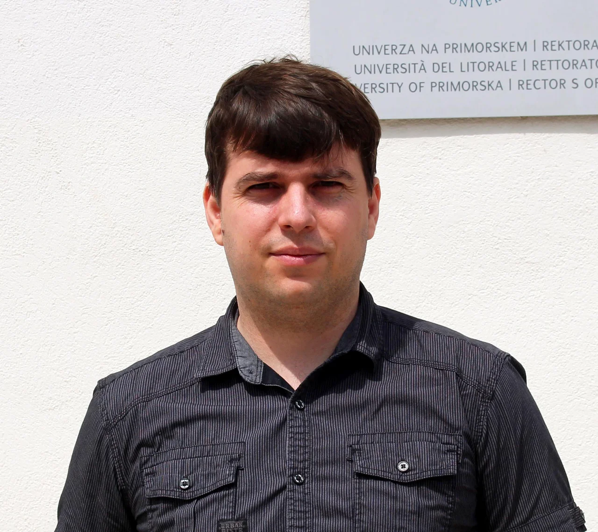

# Meet the Team

## Coordinators

  
  

    <strong><a href="https://www.rhodes.edu/bio/eric-gottlieb">Eric Gottlieb</a></strong> (Rhodes College) 
    Eric is a Professor of Mathematics at Rhodes College whose expertise bridges algebraic combinatorics and strategic gameplay. As a recent Fulbright Scholar, he is actively collaborating with the UP FAMNIT team to analyze the computational complexity of combinatorial games on integer partitions.
  

  
  

    <strong><a href="https://rutcor.rutgers.edu/~gurvich/">Vladimir Gurvich</a></strong> (Rutgers University) 
    Vladimir is a prolific researcher at Rutgers University whose foundational work spans game theory, discrete optimization, and structural graph theory. His extensive collaboration with the lab focuses on structural properties of positional, subtraction, and partition-based games.
  

  
  

    <strong><a href="https://mkrnc.github.io/">Matjaž Krnc</a></strong> (UP FAMNIT) 
    Matjaž is an Associate Professor at UP FAMNIT working in structural graph theory and combinatorial game theory. His research interests include the computational complexity of sequential games of perfect information and strategic play.
  

  
  

    <strong>Peter Muršič</strong> (UP FAMNIT) 
    Peter earned his PhD at Rutgers University with a deep focus on game theory, and he now advances this research at UP FAMNIT. He specializes in the mathematical mechanics behind combinatorial games, dissecting optimal strategies and analyzing complex game structures.
  

---

## Collaborators

* Daniil Baldouski (UP FAMNIT)
* Ina Bašić (TU Darmstadt)
* [Nino Bašić](https://osebje.famnit.upr.si/~nino.basic/) (UP FAMNIT)
* Amalia Bay (Rhodes College)
* Nina Chiarelli (UP FAMNIT)
* Aayan Deb (Rhodes College)
* Soumitro Dwip (Rhodes College)
* Jelena Ilič (UP FAMNIT)
* Rubaiya Islam (Rhodes College)
* Sahaf Mahmud (Rhodes College)
* Hannah Meit (Rhodes College)
* Labib Muzahid (Rhodes College)
* Ismael Qureshi (Rhodes College)